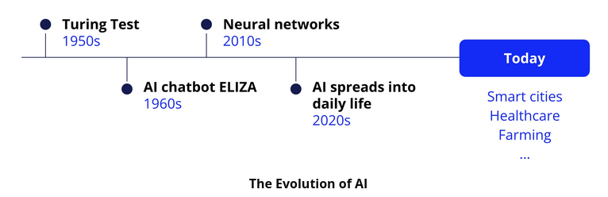
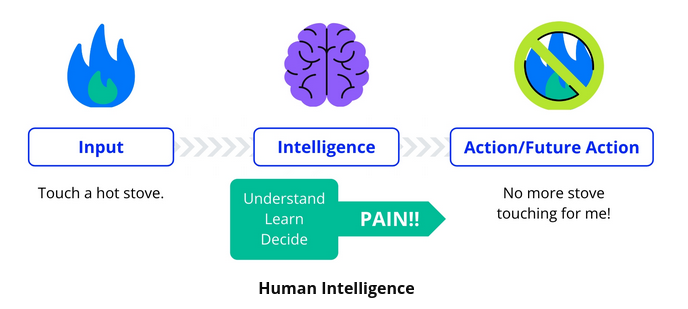
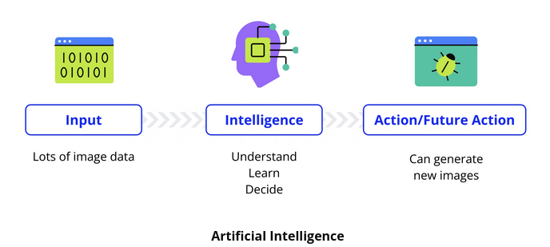
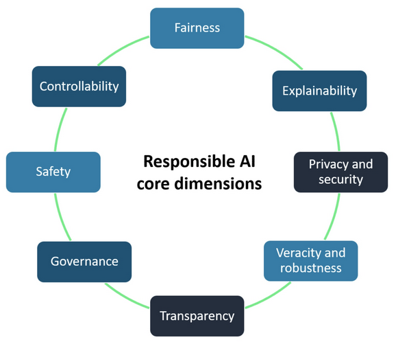

## Historical Development

AI exploration began in the 1940s and 1950s, inspired by the human brain's workings. Notable contributions include:

* The Turing Test, by Alan Turing, used to determine a machine's capability to exhibit intelligent behavior.
* [ELIZA](https://anthay.github.io/eliza.html), the first AI chatbot created in the 1960s.

## Defining Artificial Intelligence

Artificial Intelligence (AI) involves simulating human-like reasoning and cognitive processes in computers, aimed at creating systems capable of performing tasks requiring intelligence when done by humans. These tasks include:

* Recognizing patterns.
* Speech recognition.
* Decision-making.
* Making predictions.

Human intelligence processes information, learns from it, and informs future actions based on the learned information, e.g., learning not to touch a hot stove after experiencing a burn.

In AI, the goal is to replicate human learning and decision-making processes by creating sophisticated computer programs that can:

* Process vast data.
* Learn patterns.
* Make informed decisions.

A practical example includes streaming platforms using AI to analyze user preferences, compare them with other users, and recommend shows or music, improving recommendations as more data (user interaction) is collected.

## Artificial Intelligence in Society

Artificial Intelligence (AI) is subtly integrated into our daily lives, making tasks simpler, more efficient, and personalized. It's often unnoticed, termed as "silent" AI. Examples include:

* Auto-tagging in social media.
* Fraud detection in banking.
* Recommendation systems in music playlists or online shopping.
* Smart thermostats adjusting temperatures.
* Ride-sharing apps optimizing routes and prices.
* Wearable devices monitoring health metrics.

**Responsible Use and AI Ethics**

As AI aims to learn like humans, attention must be paid to AI Ethics, which include:

* What computers learn.
* How they learn it.

Ensuring AI is fair, unbiased, and respects human rights, equity, and privacy is crucial for societal benefit.

## Responsible AI

You’ve now seen how AI can understand and respond to human input—whether it’s a chatbot like ELIZA, a voice assistant like Alexa, or a customer support bot. But AI isn't just about getting the right answers; it’s also about making sure the way it works is fair, safe, and trustworthy.

AI is already part of everyday life, from recommendation systems on social media to self-driving cars. But what happens if an AI makes unfair decisions? What if it misuses personal data or operates in a way people don’t understand?

That’s where responsible AI comes in. It’s about making AI systems that are fair, safe, transparent, and under human control.

To build AI that people can trust, we need to think about these key areas:

1. **Fairness**: AI should treat everyone equally, without bias or discrimination.

Imagine you ask Alexa, “What are the best colleges near me?”, but it only recommends colleges for a certain group of people, leaving out others. That would be unfair AI.

Fairness means AI should work for everyone, not just a specific group. AI should avoid discrimination and be designed so that all users get accurate and helpful results.

2. **Explainability**: AI Shouldn’t Be a Black Box

If you ask a chatbot, “Why did you give me this answer?”, and it can’t explain itself, that’s a problem.

Explainability means AI should be able to clearly describe how it made a decision. If an AI model rejects a loan application or recommends a medical treatment, humans should understand why.

3. **Privacy & Security**: AI Should Protect Personal Data

Would you be okay if AI recorded every conversation in your house and shared it? Probably not!

Privacy means AI should give users control over their personal data. Security means keeping that data safe from hackers or leaks.

4. **Transparency**: AI Shouldn’t Hide How It Works

Ever used an app that randomly changes its recommendations without telling you why? That’s a lack of transparency.

Transparency means AI should openly share how it was built, what it can do, and what its limits are. If an AI model is used in hiring, companies should explain how it chooses candidates.

5. **Robustness**: AI Should Work Even in Unpredictable Situations

What if Alexa misunderstood your question and started ordering random products? Or if a self-driving car misread a stop sign?

Robustness means AI should be able to handle errors, new situations, and unexpected inputs without failing.

6. **Governance**: AI Should Follow Rules & Ethical Standards

Just like companies have rules for safety and fairness, AI needs rules too. Governance means making sure AI follows laws, ethical guidelines, and company policies.

For example, social media AI should prevent harmful content from spreading, and AI in finance should prevent fraud.

7. **Safety**: AI Shouldn’t Cause Harm

What if a medical AI recommended the wrong diagnosis? Or a self-driving car didn’t stop at a red light?

AI safety means testing and designing AI carefully to prevent harm to people or the environment.

8. **Controllability**: Humans Should Stay in Charge

AI should never be completely out of human control. Controllability means people should be able to monitor, correct, or stop AI systems when needed.

For example, an AI chatbot shouldn’t spread false information, and self-driving cars should have emergency stop features.