## Artificial Intelligence: Machine Learning

Human Intelligence (HI) and Artificial Intelligence (AI) pertain to information processing and decision-making. While humans naturally process multifaceted information and make decisions, the goal of AI is to enable machines to mimic this ability.

For instance, recognizing a favorite song involves processing various data points:

* Sound
* Lyrics
* Artist
* Video
* Title, and
* Similarity to other songs.

This lesson is about how we can implement machine learning to process information and make informed decisions, like identifying a song's artist with a degree of certainty.

Key Terms and Concepts:

* Human Intelligence (HI): The innate ability of humans to process information and make decisions based on it.
* Artificial Intelligence (AI): The endeavor to equip machines with human-like information processing and decision-making capabilities.
* Machine Learning (ML): A subset of AI, it involves training computers to learn from data and improve over time.
* Data Points: Individual pieces of information processed for decision-making.
* Certainty: The level of confidence in making a decision based on processed information.

## What is Machine Learning

**Building a Game: A Dive into Machine Learning Systems**

The journey of teaching a computer to play a video game unveils the essence of Machine Learning (ML), a vital segment of Artificial Intelligence (AI). In this realm, we craft machine learning algorithms to empower a computer system to autonomously learn from data, devoid of manual, step-by-step guidance. Encoded in languages like Python, these algorithms sift through data to unearth patterns, laying the groundwork for future predictions. The ensemble of data, ML algorithms, and the learning trajectory constitute a Machine Learning System. At its core lie three pillars:

* Data - The myriad forms of digital information like images, text, pixels, and numbers that fuel the learning process.
* ML Algorithm Code - The rulebook guiding the processing of data.
* Machine Learning Model - Often dubbed as the system's "brain," it harnesses algorithms to process data, paving the path for predictions or decisions.

The venture begins with training the model using a designated algorithm, transitioning next to testing its performance with fresh data, akin to gauging a game-playing bot's prowess in a gaming arena. Through a cycle of training, testing, and adjustments, we endeavor to escalate the model's performance to hit the bullseye—be it triumphing in a game or nailing a song artist identification.

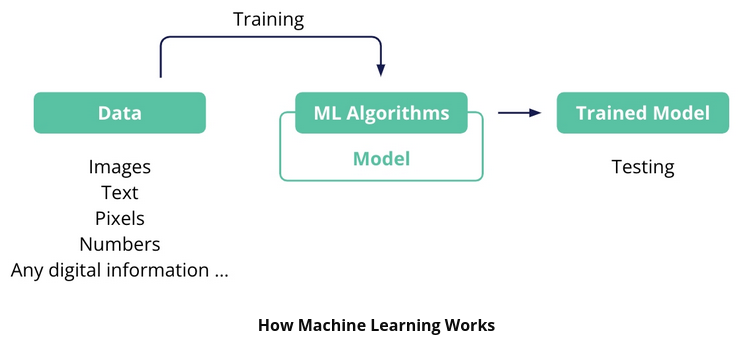

Key Terms and Concepts

1. Machine Learning (ML) -The compass directing computers towards autonomous learning and pattern discernment from data, under the vast umbrella of AI.
2. Machine Learning System - The harmonious blend of data, ML algorithms, and a machine learning model.
3. Machine Learning Model - The system's intellect, processing data through algorithms to forge predictions or decisions.
4. Training - The saga of nurturing the model by processing data through the ML algorithm code.
5. Testing - The act of gauging the model's mettle using new data, post-training.
6. Iteration - The cycle of tweaking algorithms and data, coupled with re-training, aiming to uplift model performance.

## Types of Machine Learning

**Right Learning Path: Supervised, Unsupervised, and Reinforcement Learning Explained**

When embarking on creating a machine learning model, one of the first choices you'll need to make is the type of learning approach to use. This decision hinges on the kind of data you have and the problem you're tackling. Here’s a simple breakdown of the three primary learning types: Supervised, Unsupervised, and Reinforcement Learning.

**Supervised Learning**

* Like Learning with a Teacher - You provide the model with data and the correct answers (labels) for each data point, much like showing a picture of a cat and telling the model it's a cat.
* When to Use - If you have labeled data and you want the model to learn the right answer from this data.
* Examples - Classifying images, speech recognition, self-driving car tasks like identifying pedestrians, bank fraud detection.

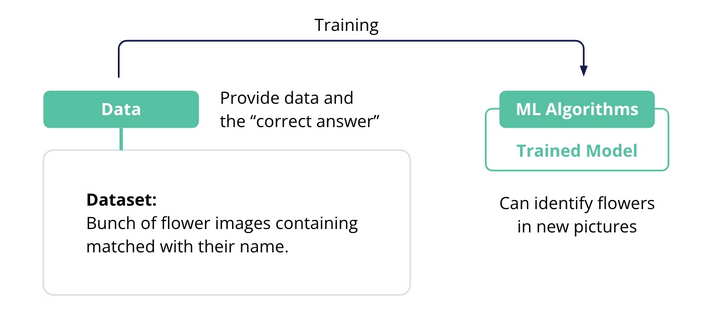

<em>Uses Labeled Data to Train the Model</em>

**Unsupervised Learning**

* Learning on its Own - The model explores a lot of data on its own to find patterns and structures, akin to solving a puzzle without seeing the picture on the box.
* When to Use - If you have unlabeled data and you want the model to find patterns or structures in the data.
* Examples - Generating new songs, writing code, handling massive datasets with unlabeled data.

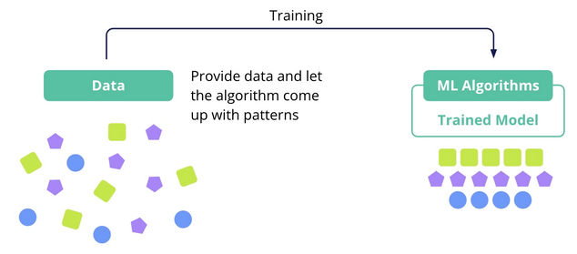

<em>Uses Unlabeled Data and the Model Finds the Patterns</em>

**Reinforcement Learning**

* Learning by Trial and Error - The model learns by interacting with an environment, receiving rewards for right actions and penalties for wrong ones, much like training a pet.
* When to Use - When you want your model to learn from its interactions and feedback, without needing labeled data.
* Examples - Playing video games, robotics, real-time decision-making in self-driving cars.

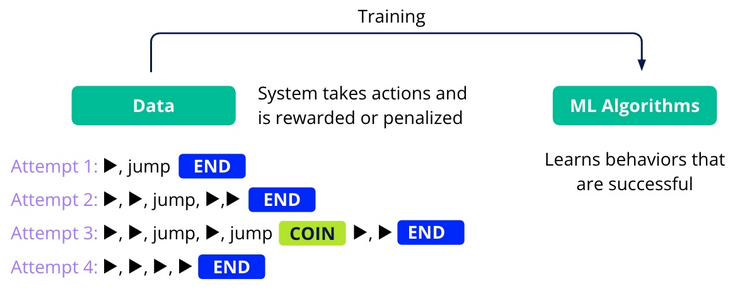

<em>Uses Rewards and Penalties (Trial and Error) to learn behaviors for success</em>

In more complex real-world problems, a blend of these learning types might be employed, with multiple models each handling specific tasks, much like a team of specialists working together towards a common goal.

## Exercise: Supervised vs Unsupervised

### Part 1: Predicting Building Energy Efficiency (Supervised Learning)

Scenario - You are working for an architecture firm, and your task is to build a model that predicts the energy efficiency rating of buildings based on features like wall area, roof area, overall height, etc.

**To predict the energy efficiency of buildings.** In this exercise, you trained a RandomForestRegressor model to predict the energy efficiency of buildings based on features such as wall area, roof area, overall height, and glazing area.

Expected Results

* Data Visualizations - Scatter plots will show the relationship between each feature and the target variable (energy efficiency). Students should observe how changes in features may relate to energy efficiency, although with synthetic data, these relationships might not show clear trends.
* Model Performance - After training the model and making predictions, students will evaluate the model using Mean Squared Error (MSE). With synthetic data, the MSE value may vary, but it gives an idea of the average error in the model's predictions. The closer this value is to zero, the better the model's performance.
* Prediction vs. True Value Plot - The scatter plot comparing true values and model predictions should ideally show points along the diagonal line (y=x), indicating accurate predictions. Deviations from this line suggest prediction errors.
* Remember to delete the notebook instance.

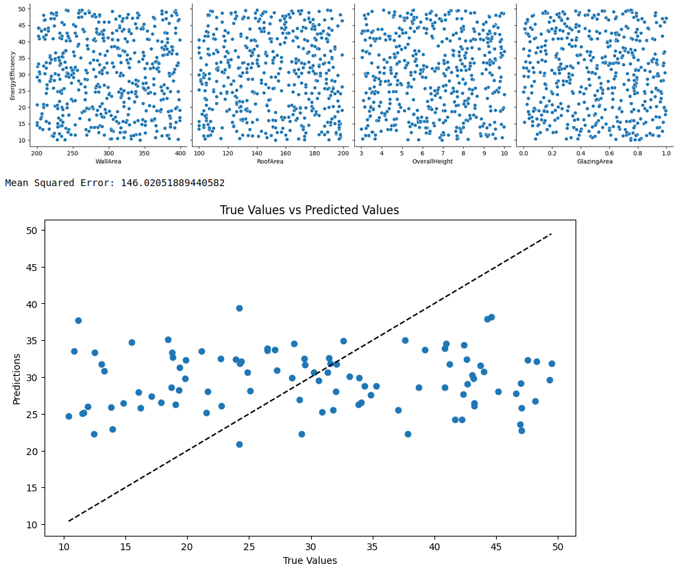

### Part 2: Vehicle Clustering (Unsupervised Learning)

Scenario - You are working for an automotive company, and your task is to cluster vehicles into groups based on their features such as weight, engine size, and horsepower.

**To cluster vehicles based on their specifications.** In this exercise, you used KMeans clustering to group vehicles based on their features like weight, engine size, and horsepower.

Expected Results

* Cluster Visualization - The scatter plot will visually depict how vehicles are grouped based on weight and horsepower. Each cluster will be represented by a different color. With synthetic data, the distinctness of clusters may vary, but students should be able to see groupings based on the chosen features.
* Interpreting Clusters - There are no 'correct' labels in unsupervised learning, but students should observe how vehicles are grouped based on similarities in their features. They might see, for example, that heavier vehicles with higher horsepower are grouped together.

In both tasks, the exact numerical results can vary based on the randomness in the synthetic data generation and the inherent variability in machine learning models. The key learning outcome is understanding the process of applying machine learning techniques and interpreting the results, rather than achieving specific numerical accuracy or clustering results.

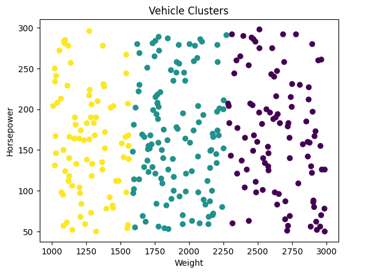

## Algorithms and Models

Building a machine learning model involves deciding on the learning type, selecting an approach or algorithm, and then training the model to optimize its performance. This journey begins with traditional machine learning approaches like:

* Decision Trees
* Regression
* Clustering Algorithms

which are apt for structured data. However, for handling large volumes of unstructured data and achieving high accuracy in complex tasks, deep learning, powered by neural networks, becomes the go-to.

The choice between traditional machine learning and deep learning hinges on the data, the problem at hand, and the available resources.

**Traditional Machine Learning**

* Decision Trees - Flowchart-like structures aiding in decision-making based on data features.
* Regression Algorithms - Useful for predicting numerical values by modeling relationships between variables.
* Clustering Algorithms - Group data into clusters based on similarity, aiding in data segmentation and categorization.

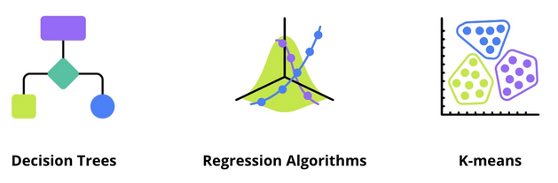

**Deep Learning**

* Artificial Neural Networks - Inspired by the human brain, these networks excel in processing huge amounts of data and learning patterns from it.
* Convolutional Neural Networks (CNNs) - Specialized for vision tasks, preserving spatial context of images.
* Recurrent Neural Networks (RNNs) - Efficient for sequential data, aiding in tasks like predictive text.

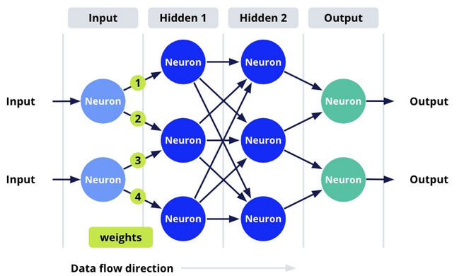

**Advanced Deep Learning**

* Generative Models - Aim to generate new data samples similar to input data, useful in creating new content.
* Transformer Architecture - Consisting of encoders and decoders, crucial in language translation and code generation tasks.

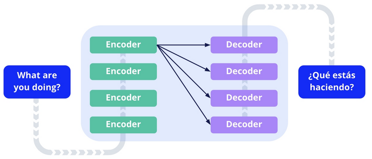

## Exercise: Decision Tree

Imagine you are a data analyst at a telecom company. The marketing department has noticed an increase in customer churn and needs your help to identify which customers are most likely to leave next month.

In this exercise, you will build a decision tree model to predict customer churn for a telecom company. Customer churn refers to when a customer stops doing business with a company. Predicting churn is crucial for businesses to retain customers by addressing their issues proactively.

**Dataset Description**

We will use a synthetic dataset for this exercise. The dataset contains the following columns:

* CustomerID: A unique identifier for each customer.
* Age: The age of the customer.
* MonthlyCharge: The monthly bill amount for the customer.
* CustomerServiceCalls: The number of times the customer contacted customer service.
* Churn: This is our target variable, indicating whether the customer churned (Yes) or not (No).

**Key Concepts**

* Splitting the Dataset - The dataset is divided into training and testing sets. Typically, 70% of the data is used for training the model, and the remaining 30% is reserved for testing.

* Training Data vs. Testing Data - Training data is used to train the machine learning model. In contrast, testing data, which the model has not seen during training, is used to evaluate the model's performance and generalization ability.

* Model Training Process - The process involves using a 'fit' method where the model is trained using features (X_train) and targets (Y_train). The testing data is not used in this stage.

* Prediction and Accuracy Assessment - After training, the model makes predictions on the test data (X_test). These predictions are then compared with the actual outcomes (Y_test) to calculate the model's accuracy.

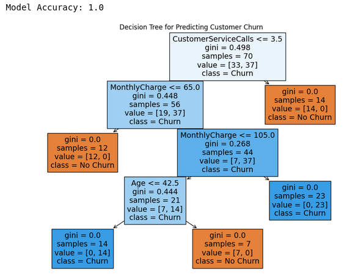

## Exercise: Neural Networks

For this exercise, you will create a simple neural network example. We'll use a synthetic dataset to predict whether a customer will make a purchase based on two features:

* Website visit duration
* Number of pages visited.

Unlike decision trees, neural networks are not easily visualizable in terms of their decision-making process because they are considered "black box" models. However, there are some aspects of neural network models that you can visualize to gain insights. For the given example, we can visualize the following:

* Training Process - You can plot the training and validation loss and accuracy over epochs to understand how the model is learning.
* Decision Boundary - For a simple neural network like the one in our example (with two input features), you can visualize the decision boundary on a 2D plot.

Here's how you can implement these visualizations -

**Model Accuracy and Loss**

In the context of the neural network exercise for predicting customer purchase behavior, "model accuracy" and "model loss" are two important metrics used to evaluate the performance of the model. Here's a concise explanation of each:

1. Model Accuracy is the fraction of predictions our model got right. In the context of the exercise, it is the proportion of correctly predicted purchase decisions (both purchases and non-purchases) out of all predictions made.

    * Formula - Accuracy = (Number of Correct Predictions) / (Total Number of Predictions)
    * Interpretation - a higher accuracy indicates a better performing model. For example, an accuracy of 0.90 means that 90% of the model's predictions are correct.

2. Model Loss measures how far the model's predictions are from the actual class labels. It is a measure of the model's error. 
    * Binary Cross-Entropy - is commonly used in binary classification tasks. It calculates the loss for each instance by comparing the predicted probability with the actual label (either 0 or 1), and then takes the average over all instances.
    * Interpretation - lower loss values are better, indicating that the model's predictions are closer to the actual labels. A high loss value means the model's predictions are far off from the actual labels.

**Result**

* Test Accuracy: 0.375

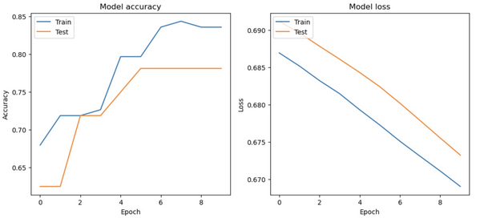

**Decision Boundary**

In the context of the neural network exercise for predicting customer purchase behavior, the decision boundary is a concept used to visualize how the neural network categorizes or classifies the data.

The Decision Boundary is a boundary in the feature space that separates the data points into different classes based on the predictions made by the model. In our exercise, we have two input features: website visit duration and number of pages visited. The decision boundary will be a line or curve in this 2-dimensional space that separates the points predicted to make a purchase (class 1) from those predicted not to make a purchase (class 0).

* How It's Determined - The neural network learns the decision boundary during training. It adjusts its internal parameters (weights and biases) to correctly classify the training data. The boundary is where the model's output (before applying a threshold) is at some critical value, often 0.5 for binary classification with a sigmoid output. Points on one side of the boundary are classified as one class, and points on the other side as the other class.

* Visualization - In the plot, the decision boundary is typically represented by a line or contour. Points falling on one side of the boundary are predicted to be in one class, and those on the other side in the other class. The decision boundary can be linear or non-linear depending on the complexity of the model and the nature of the data.

The decision boundary in our neural network example serves as a visual tool to understand how the model differentiates between customers likely to make a purchase and those who are not, based on their website engagement metrics.

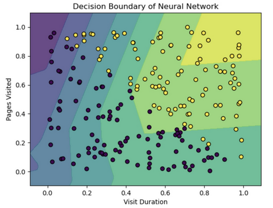

## Discriminative, Predictive, and Generative AI

Machine Learning (ML) has progressed significantly with the advent of Deep Learning and Transformer Architecture, providing two prime categories:

* Discriminative (Predictive) AI
* Generative AI

Discriminative AI excels in categorization, and spotting boundaries in data to predict outcomes. Examples of discriminative models include:

* Decision Trees
* Linear Regression
* Convolutional Neural Networks (CNNs)
* Recurrent Neural Networks (RNNs)

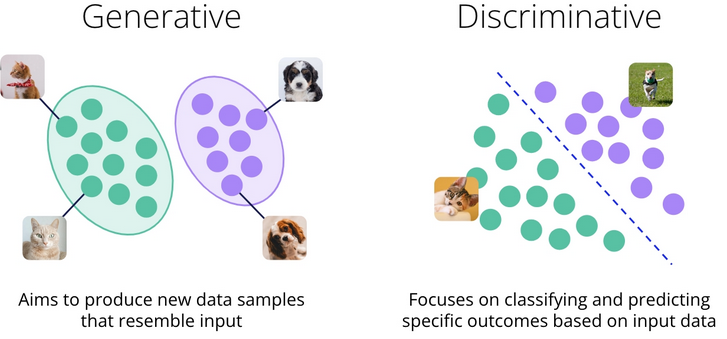

**Generative AI**

Generative AI shines in creating new data resembling the input, with models like:

* Generative Adversarial Networks
* Variational Autoencoders

The choice between these paths is based on:

* Task complexity
* Data quality
* Computational resources.