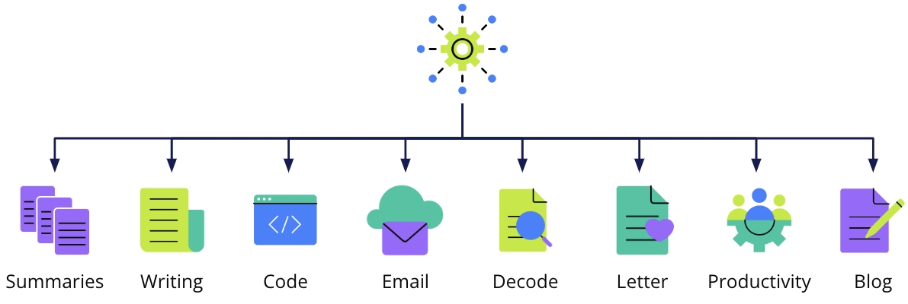
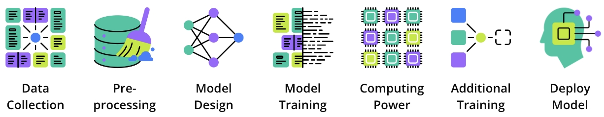
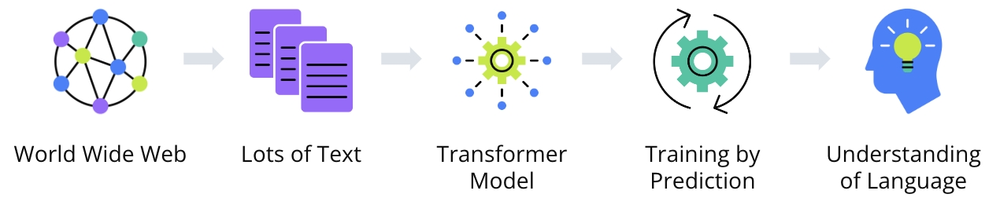
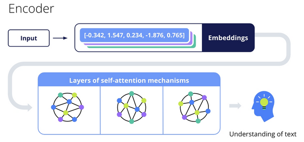
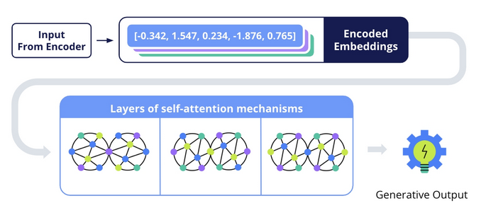
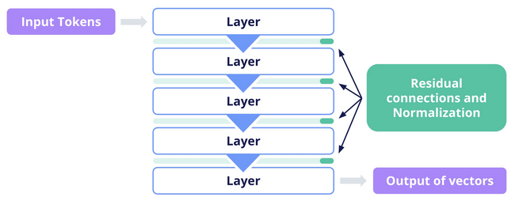
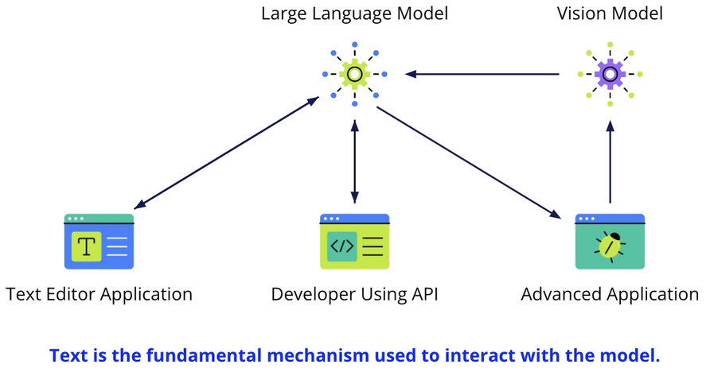
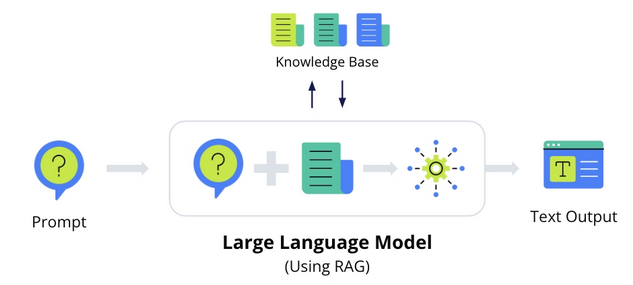

## Introduction to Understanding and Using Large Language Models (LLMs)

In this lesson, we delve into the fascinating world of Large Language Models (LLMs), extraordinary tools at the forefront of artificial intelligence. LLMs are not just theoretical constructs but practical tools, aiding in tasks like writing emails, generating creative content, and interpreting complex information.

**Large Language Models (LLMs)** - Advanced machine learning systems that understand and generate human language, mimicking human-like conversation and writing.

**Prompt Engineering** - A skill to effectively use LLMs, involving the crafting of inputs to get desired outputs.



**Applications of LLMs**

* Crafting professional emails.
* Generating creative writing prompts.
* Simplifying complex information into summaries.
* Assisting in writing heartfelt letters, blog ideas, or decoding legal documents.
* Writing code and enhancing productivity at work.

## What is a Large Language Model (LLM)

Large Language Models (LLMs) represent a significant advancement in artificial intelligence, specializing in processing, understanding, and generating human language. These models are distinguished by their size, both in terms of the vast number of parameters and their extensive training data.

**Key Characteristics**

* Extensive Training Data - LLMs are trained on a wide array of text sources, enabling them to learn diverse linguistic patterns and styles.
* High Capacity - With billions of parameters, LLMs can store and recall extensive information about language.
* Deep Understanding - They can comprehend context and nuances in language, performing complex tasks like summarization, translation, and conversation.
* Transformer Architecture - Most LLMs use transformer architecture for efficient text processing and adaptable attention to different parts of the input.
* Content Generation - Capable of generating coherent and contextually relevant text, including essays, poetry, and code.



**Creation Process**

* Data Collection - Gathering a large and varied dataset from multiple text sources.
* Pre-processing - Cleaning and preparing the data for training.
* Model Design - Selecting a neural network architecture, typically a transformer model.
* Training - Using machine learning algorithms to improve the model's accuracy in predicting text sequences.
* Computing Power - Requiring powerful GPUs or TPUs for processing and training.
* Additional Training - Further training on specific datasets for specialized tasks.
* Deploying the Model - Making the model available for user queries and prompts.

**Challenges and Accessibility**

* Creating an LLM requires immense computational resources, data management, and expertise.
* Ensuring fairness, lack of bias, and user privacy are crucial considerations.
* Although resource-intensive to develop, LLMs are often made accessible to the public via APIs and applications.

### Exercise: Using LLMs with PartyRock

[PartyRock](https://partyrock.aws/?utm_source=udacity&utm_medium=course&utm_campaign=introtogenai), an Amazon Bedrock Playground, allows you to experiment and create applications that use generative AI without needing an AWS account or credit card.

In the video above, the app is built by providing a prompt to PartyRock, which then uses a large language model to understand the request and generate the application.

**Key features include:**

* Intuitive App Creation - build apps for various purposes.
* Learning and Experimentation - It's an educational tool for understanding generative AI, experimenting with foundation models, and mastering text-based prompting and prompt chaining.
* Ease of Access - Require no coding expertise and is accessible via a web-based UI.

### LLMs for Code Generation

**Code Generation**

Amazon CodeWhisperer is a tool designed to enhance software developers' efficiency. It excels in using an LLM to generate code snippets from text prompts, reducing time spent on routine coding and allowing developers to focus on complex tasks.

How It Works

Using the AWS Cloud9 editor:

* Users simply input a comment describing the desired function.
* Amazon CodeWhisperer then uses autocomplete to suggest relevant code.

This service significantly reduces the time spent on writing standard boilerplate code, allowing developers to focus on more complex, value-adding aspects of their projects.

### Natural Language Models

Natural Language Processing (NLP) is a critical field within artificial intelligence, combining computational linguistics with machine learning and deep learning techniques to enable computers to process and understand human language in both text and voice forms.

Key Processes in NLP

* Tokenization - Breaking down text into smaller units (tokens), such as words or phrases, for easier analysis.
* Parsing - Analyzing the grammatical structure of sentences to understand how words relate to each other.
* Semantic Analysis - Understanding the meaning behind words by considering context, synonyms, and ambiguities.
* Contextual Understanding - Utilizing the context of surrounding sentences to enhance interpretation, including understanding implied meanings and intentions.
* Statistical Inference - Using probabilities to predict subsequent words or appropriate responses in a conversation.
* Machine Learning Integration - Continuously learning from new inputs to improve language prediction and understanding.

NLP is crucial in enabling machines to decode human language, comprehend the intended meaning, and generate coherent, relevant responses.

It represents a complex interplay of various processes that equip machines with linguistic understanding capabilities.

### Evolution of Large Language Models

**The Evolution of Large Language Models (LLMs)**

The journey of Large Language Models (LLMs) in Natural Language Processing (NLP) is a story of increasing sophistication and capability. Starting from rule-based systems and progressing through various stages of machine learning and deep learning, LLMs have become adept at understanding and generating human-like text.



**Evolutionary Stages**

* Rule-Based Systems - Early models based on explicit grammatical and syntactic rules, limited and inflexible.
* Statistical Models - Shifted to probability-based predictions, enabling more complex language processing.
* Machine Learning Models - Began understanding context and patterns, but struggled with long-range dependencies.
* Neural Networks (RNNs and LSTMs) - Improved handling of sequences and memory, marking significant progress.
* Transformer-Based Architectures - Introduced attention mechanisms, allowing models to weigh the importance of each part of the sentence, thus capturing intricate relationships and context.

**Capabilities of Modern LLMs**

* LLMs, particularly those based on transformer architectures, demonstrate a deep understanding of context and relationships within text.
* They can predict and generate text coherently, using the context from preceding text.
* LLMs are capable of performing complex tasks like translation, conversation, and content creation, with a nuanced understanding of language.

## How Large Language Models Work

Understanding how transformer models process language is crucial in appreciating the capabilities of Large Language Models (LLMs). These models use a series of intricate steps to convert text into a numerical format that can be processed by neural networks, leading to a deep understanding of language.
Key Concepts

* Transformer-Based Architectures - These are types of neural network architectures that have become fundamental in state-of-the-art natural language processing (NLP) models. They're particularly adept at handling long sequences of data and learning complex patterns.
* Attention Mechanism - A core concept in Transformer architectures. The attention mechanism, particularly self-attention, allows the model to weigh the importance of each word in a sentence in relation to every other word.
* Context Capture in Text - Transformers are notable for their ability to capture context across long stretches of text. This is a significant advancement over rule-based, statistical, and traditional machine learning approaches.
* Tokenization - The process of breaking down a sentence into tokens, which can be individual words or parts of words.

* Embeddings - The numerical representations of words or tokens, typically in the form of vectors. Embeddings convert words into a format that can be processed by neural networks and other algorithms. They capture and quantify aspects of word meanings, their use in different contexts, and their syntactic roles.
* Self-Attention in Transformers - This technique is used to calculate attention scores for each token, determining how much focus to put on other tokens in the sentence. It leads to a context-aware representation of each word.

## Encoders and Decoders

In Transformer models, these are distinct components. The encoder processes the input text, converting it into numerical values known as embeddings. The decoder then uses these embeddings to generate output text.

**Decoding Strategies**

* Greedy Decoding - Picks the most likely next word at each step. Efficient but can lead to suboptimal sequences.
* Beam Search - Tracks a number of possible sequences (beam width) to find a better sequence of words. It balances between the best local and overall choices.
* Top-K Sampling - Randomly picks the next word from the top K most likely candidates, introducing randomness and diversity.
* Top-P (Nucleus) Sampling: Chooses words from a set whose cumulative probability exceeds a threshold, focusing on high-probability options.



**Temperature Setting**

This model setting controls the randomness of token predictions. A higher temperature leads to more randomness, while a lower temperature makes the model more confident (less random) in its predictions.


## Building LLMs with Code

**Visualization and Code Implementation**

Tools like TensorBoard or Matplotlib in Python can visualize embeddings or attention scores. Code for NLP with transformer models often uses libraries like Hugging Face's transformers and deep learning frameworks like PyTorch or TensorFlow.

* Tokenization and embedding processes are handled by pre-built classes in NLP libraries.
* The transformer architecture applies self-attention and feed-forward neural networks to process embeddings.
* Visualization of embeddings or attention scores can provide insights into the model's processing.

These steps enable transformer models to understand nuances and context in language, facilitating complex tasks like translation, content generation, and conversation.

Understanding the code and the computational processes behind these models is key for those interested in NLP and AI development.

**Understanding the Process**

Let's take the sentence, "A young girl named Alice sits bored by a riverbank, …" and explore how a transformer model processes this text.

1. Tokenization - The sentence is broken into tokens. "Alice" is one token, while "riverbank" may be split into "river" and "bank".

```python
# Tokenization using Hugging Face's Transformers
from transformers import AutoTokenizer
tokenizer = AutoTokenizer.from_pretrained("gpt-2")
tokens = tokenizer.tokenize("A young girl named Alice sits bored by a riverbank...")
```

2. Embedding - Tokens are transformed into numerical vectors. For example, "Alice" becomes a vector like [-0.342, 1.547, 0.234, -1.876, 0.765].

```python
# Embedding and Processing with a Transformer Model
from transformers import AutoModel
model = AutoModel.from_pretrained("gpt-2")
inputs = tokenizer("A young girl named Alice sits bored by a riverbank...", return_tensors="pt")
outputs = model(**inputs)
last_hidden_states = outputs.last_hidden_state
```

3. Self-Attention - The model calculates attention scores for each token, understanding their importance in context.
4. Layered Processing - Multiple neural network layers process these embeddings, enhancing understanding at each step.
5. Encoders and Decoders - The encoder processes input text into embeddings, and the decoder generates output text, using strategies like Greedy Decoding or Beam Search.

```python
# Visualization of Embeddings (Simplified Example)
import matplotlib.pyplot as plt
plt.imshow(last_hidden_states.detach().numpy()[0], cmap='viridis')
plt.colorbar()
plt.show()
```



**Transformer Models**

The core of a transformer model consists of multiple layers of self-attention and feed-forward neural networks. Each layer processes the input embeddings and passes its output to the next layer.

The actual processing involves complex mathematical operations, including self-attention mechanisms that allow each token to interact with every other token in the sequence. This is where the contextual understanding of language happens.

The final output from these layers is a set of vectors representing the input tokens in context.

* Python libraries such as Hugging Face's transformers handle tokenization and embedding.
* The transformer architecture's layered processing is managed by deep learning frameworks like PyTorch or TensorFlow.
* Visualization of embeddings or attention scores can be achieved using Python's Matplotlib.

**Core Mechanism of LLMs**

* Network of Parameters and Weights - At the core of LLMs is a detailed network, similar to human brain synapses, where knowledge is encoded. Through comprehensive training, this network is refined, enabling the LLM to capture language subtleties, patterns, and complexities. Each parameter is a representation of a language element learned from training data, together forming an all-encompassing understanding of language.
* Knowledge Storage - LLMs store this knowledge meticulously in a binary format within their file structure, akin to a digital vault. These files, with extensions like .bin or .h5, are not readily interpretable but are integral to the LLM's functionality, encapsulating the culmination of its learning experience.

**Is the knowledge always accurate, right, or correct?**

Sometimes, models generate information or content that isn't accurate or doesn't align with reality. This is referred to as "hallucinating".

Generative AI models don't "understand" content in the human sense; they predict the next word in a sequence or generate pixels in images based on probability and the patterns they've seen during training. Because of this, they can sometimes generate plausible-sounding but incorrect or nonsensical information, or add an extra arm or leg to an image of a human. This happens more often when your prompt (input) is ambiguous, the topic is outside the model's training data, or the question requires nuanced understanding or specialized knowledge.

It's important to approach these models with a critical mind, understand their limitations, and double-check information when accuracy is important in their output.

**Utilization of Knowledge**

* Prompt-Driven Activation - The application of stored knowledge is triggered by prompts, acting as keys to unlock the model’s potential. Crafting effective prompts is crucial for accurate and contextually appropriate outputs.
* Knowledge Application - Once activated, LLMs analyze their parameters, applying learned insights to generate responses. In critical domains like legal or medical sectors, LLMs can incorporate real-time data, ensuring outputs are both linguistically coherent and factually accurate.

## Using pre-trained Large Language Models

**Engaging with Large Language Models (LLMs)**

LLMs have emerged as versatile tools, offering a spectrum of interaction methods tailored to diverse applications in natural language processing. While text input remains the crux of these interactions, the modalities in which LLMs are engaged vary significantly, reflecting the evolving needs of users and the innovative scope of applications.
**Direct Interaction**

At the simplest level, direct interaction with LLMs involves users inputting text for a variety of tasks, from content summarization to question answering and creative writing. This straightforward method forms the baseline of LLM engagement, showcasing their primary capability in processing and responding to textual data.
**Versatility**

The versatility of LLMs extends beyond this direct text input, as they are increasingly integrated into various applications. In the realm of text editors, for instance, LLMs function behind the scenes, enhancing user experience through advanced features such as grammar correction or predictive typing. Here, the user's interaction is primarily with the application interface, while the LLM works subtly in the background, analyzing and responding to the user-generated text.
**Using APIs**

For developers, LLMs offer a different mode of interaction through APIs. This method involves more complex engagements where the text input is part of larger request payloads, often accompanied by specific parameters and configurations. Such interactions enable customized processing by the LLM, allowing developers to create sophisticated, AI-driven tools and features.



**Combining AI Models**

In more advanced applications, LLMs are combined with other AI models, such as vision models that interpret non-textual data. An image described in text by a vision model, for instance, can be transformed into a captivating narrative by an LLM, exemplifying the model's ability to process and contextualize a wide range of information.

**Key Terms**

* Direct Text Input - The primary method of user interaction with LLMs, involving straightforward text entry for processing.
* Application Integration - Embedding LLMs within user-facing software, where they enhance functionality and improve user experience.
* API Interaction - A method for developers to access LLM functionalities, offering customizable options for various applications.
* Cross-Model Collaboration - Combining LLMs with other AI models to process and contextualize a broader scope of data.

These diverse interaction methods highlight the adaptability of LLMs, making them invaluable across different sectors. From enhancing consumer software to empowering developers and bridging different AI technologies, LLMs stand as a testament to the innovative potential of modern artificial intelligence.

## Types of Prompts

**Types of Prompts**

Zero-Shot Prompting - Providing a language model with a task without any examples of how to perform it. The model relies on its pre-training to generate a response. Example: asking for a translation without providing previous examples.

Few-Shot Prompting - Giving the model a few examples of the task along with the prompt. These examples guide the model in understanding what's expected and demonstrate the desired output format.

Chain of Thought Prompting - A technique that involves guiding the model through a step-by-step reasoning process. It's useful for complex tasks that require logic or reasoning, like math problems or cause-and-effect questions.
**Contextual Importance in LLMs**

* Guiding Responses - The context provided in prompts ensures that the responses are accurate, detailed, and relevant to the query.
* Disambiguation - It helps in clarifying ambiguous terms or phrases, enhancing the model's understanding.
* Relevance - The more relevant the context, the more on-point the LLM's output, avoiding generic or off-topic responses.

Effective prompt engineering is about striking a balance – providing enough context to guide the model while keeping the input focused and relevant. This approach enables users to harness the full potential of LLMs, turning them into powerful tools for a wide array of applications in business, research, and creative domains.

## Retrieval Augmented Generation (RAG)

**Enhancing Understanding with Retrieval Augmented Generation (RAG) in NLP**

In the evolving landscape of Natural Language Processing (NLP), the integration of Retrieval Augmented Generation (RAG) marks a significant leap. This method synergizes the linguistic finesse of Large Language Models (LLMs) with the precision of external knowledge bases, crafting responses that are not only linguistically coherent but also factually enriched.
**The Mechanism of RAG**

1. Retrieval Step
    * Upon receiving a prompt, the RAG system embarks on a quest for knowledge. It delves into vast datasets or specialized knowledge bases, seeking information that resonates with the prompt's essence.
    * Employing a trained retrieval model, it sifts through a multitude of documents, pinpointing those that shimmer with relevance and utility for the given context.
2. Generation Step
    * The journey doesn’t end with retrieval. The language model, equipped with the gleaned knowledge, weaves this information into its response fabric.
    + It's a harmonious blend – the innate understanding of language from the LLM's training interlaced with freshly acquired, specific insights from external sources. The outcome? A response that's not just articulate but informed and contextual.



**The Art of Prompt Engineering in RAG**

* Here, the craft of prompt engineering ascends to a pivotal role. It's akin to setting the coordinates for a voyage – the prompt doesn't just ignite the generation process; it also steers the retrieval mechanism towards the most pertinent information.
* A meticulously engineered prompt is the compass that guides the RAG system through the vast seas of data, ensuring that the treasures it fetches are exactly what's needed to construct a response that hits the mark.

**The Balance of Power and Responsibility**

* While RAG systems are potent tools in the arsenal of NLP, wielding them, especially in critical fields like medicine, calls for responsibility. The information they generate, while advanced and comprehensive, still requires the discerning eye of human validation.
* RAG systems are valuable in domains requiring accuracy and up-to-date information, like medicine.
* They can synthesize information from recent research papers and studies to generate informed content.
* In critical domains like medicine, it's essential to verify RAG-generated information against trusted sources.
* While RAG enhances content generation, careful use and validation are key to ensuring accuracy and reliability.

## Foundation Models

Foundation Models in Machine Learning

Foundation models represent a significant shift in machine learning and artificial intelligence. They serve as versatile and powerful platforms for a variety of applications, thanks to their extensive training and generalization capabilities. Here's a concise overview of their key attributes:

* Scale - These models are colossal in size, often encompassing billions of parameters, making them capable of learning from and processing enormous datasets.

* Generalization - Their design enables them to generalize knowledge across different languages, tasks, and domains. This broad scope allows them to capture a vast array of information and nuances.

* Adaptability - One of their standout features is adaptability. Foundation models can be fine-tuned with additional training to cater to specific tasks or requirements, enhancing their flexibility and utility in various applications.

* Capabilities - They boast a range of capabilities across different modalities, such as text and images. This versatility makes them suitable for diverse applications like language translation, question-answering, content summarization, image recognition, and more.

* Shared Architecture - A single foundation model can act as a base for developing numerous specialized models. This approach significantly reduces the resources and time required to develop new models for different tasks, as it eliminates the need to train a new model from the ground up for each specific application.

Examples of foundation models include BERT for natural language understanding, GPT-3 for generative text applications, and T5, which handles a range of text-based tasks. The concept extends beyond language models, encompassing any pre-trained model that offers a foundational platform for further specialized learning and application development.